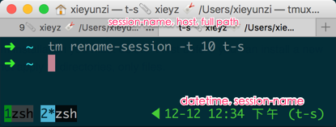

## Custom *nix config files, for mac and ubuntu

```
 tmux   > keymaps, vi mode, status bar
 fzf    > command line fuzzy finder
 vim    > useful plugins
 git    > global git config and aliases
```

### mac 和 ubuntu 都能用的配置

- shell
- tmux
- vim
- git
- ruby

[how to manage your dotfiles 中文](zx-docs/how_to_manage_your_dotfiles_files.md)

### screenshot



### structure

store configuration files in `~/.dotfiles` folder and symlink them to `~`

```bash
$ cd ~
$ tree -a -L 2

...
├── .dotfiles
│   ├── .git
│   ├── .gitignore
│   ├── .gitmodules
│   ├── README.md
│   ├── git/
│   ├── vim/
│   ├── tmux/
│   ├── shell/
│   ├── ...
...
├── .tmux/ -> .dotfiles/tmux/.tmux/
├── .tmux.conf -> .dotfiles/tmux/.tmux.conf
├── .zshrc -> .dotfiles/shell/.zshrc
...
```

### installing

i manage symlinks with [gnu stow](http://www.gnu.org/software/stow/)

`stow` is available for all linux and most other unix like distributions via your package manager.

- for ubuntu `sudo apt-get install stow`
- for mac `brew install stow`

```bash
# navigate to your home directory
cd ~
# clone the repo:
git clone https://github.com/xieyunzi/dotfiles.git .dotfiles
# enter the `.dotfiles` directory
cd .dotfiles
git submodule init --recursive
# install the zsh settings
stow shell
stow vim
stow tmux
# etc, etc, etc...
# (`stow --help` get more usage)
```

### how it works

by default the stow command will create symlinks for files in the parent directory of where you execute the command. so my dotfiles setup assumes this repo is located in the root of your home directory `~/.dotfiles`. and all stow commands should be executed in that directory. otherwise you'll need to use the `-d` flag with the repo directory location.

to install most of my configs you execute the stow command with the folder name as the only argument.

to install my **shell** configs use the command:

```bash
~/.dotfiles$ stow shell
```

this will symlink files to `~` and various other places.

**note:** stow can only create a symlink if a config file does not already exist. if a default file was created upon program installation you must delete it first before you can install a new one with stow. this does not apply to directories, only files.

### reference

- dotfiles
  - https://github.com/xero/dotfiles#how-it-works
  - https://github.com/skwp/dotfiles
- fonts
  - [ascii fonts](http://www.askapache.com/online-tools/figlet-ascii/)
